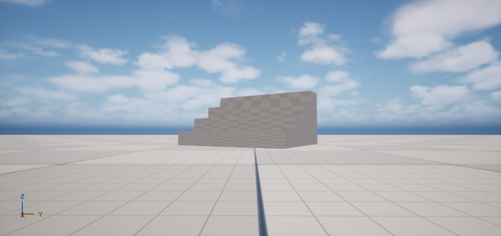

# Jev_Unreal

[](https://github.com/FahadArfin/Jev_Unreal/actions/workflows/ci.yml)
[](LICENSE)

**Inspect Unreal, preview measured edits, and verify fresh results. Jev helps when a semantic choice is useful.**

A coding agent can ask Jev to choose a tool or classify diagnostics, while deterministic code validates and executes bounded Unreal editor operations. Independent community project inspired by [cnrveysel/JevUnreal](https://github.com/cnrveysel/JevUnreal).

**Status: 0.8 alpha.** Python MCP server + source-built Unreal editor plugin, with **54 MCP tools**. Initial target: Windows and Unreal 5.8.2. Python tests run on Windows/Linux; Linux/macOS Unreal builds are not certified. See [validation evidence](docs/VALIDATION.md) and [release notes](CHANGELOG.md). This is not an official Epic or TypeSafe product.

## What works

- Jev **Choice, Score and Noul** through OpenRouter's Decisions API or TypeSafe directly.
- Batched questions, strict response validation, bounded in-memory cache, request limits, timeouts and a circuit breaker.
- Tool recommendation with explicit deferral for unsuitable choices or missing uncertainty data.
- Discover explicitly configured local MCP catalogs, search compact descriptions, and retrieve exact schemas on demand. Optional Jev shortlist selection never executes another server's tools.
- Local diagnostic grouping, repetition counts and line evidence; optional batched Jev classification.
- Asset candidate filtering by known class, dimensions and collision, with optional Jev selection.
- Compact editor context: selection, dirty packages, play state, actor metadata and project identity.
- Exact static mesh bounds, materials, LOD and collision inspection; bounded scene validation warnings.
- Exact actor inspection with world bounds, assigned materials and explicit native edit blockers.
- Selected-actor snapshots, fresh before/after diffs, and explicit passed/failed/unverifiable checks.
- Native viewport framing with current/isometric/top/front/right views and PNG capture as MCP image content.
- Preview/apply primitive blockouts, existing static mesh placement, transforms, material assignments and actor labels/folders, with native Undo.
- Measured grid, staircase and room recipes, with automatic transform readback checks after apply.
- Measured alignment, distribution, pivot grid snapping and grounding on a specified plane, preserving rotation and scale.
- Reviewed placeholder mesh replacement with an explicit material policy, plus controlled copies of native props with fresh mesh/material/settings checks. See [mesh workflows](docs/MESH_WORKFLOWS.md).
- **Window → Jev Review**: inspect selected actors, preview translation/naming/folders, read explicit before/after changes, and apply once inside Unreal. Keyboard-focusable review/results, expandable technical details and separate refresh diagnostics support deliberate human review. See [review workflow](docs/REVIEW_PANEL.md).
- Native plan receipts that survive an MCP reconnect while the editor stays open.
- Already-loaded native Blueprint graphs, variables, pins and stored compiler messages; direct asset dependencies and recorded import provenance.
- Widget/animation Blueprint inspection and project-approved, one-shot [compile review and fresh diagnostics](docs/BLUEPRINT_WORKFLOWS.md), with retained outcomes after MCP reconnects.
- [Ten domain workflows](docs/DOMAIN_WORKFLOWS.md): approved Blueprint math literals, material parameters, extended mesh-copy settings, collision-surface placement, import/dependency diagnosis, lights and camera poses, native navigation checks, editor timing comparisons, skeleton/animation checks and stored Widget tree diagnostics. Each declares its supported scope.
- Explicitly approved native Data Validation rules with bounded jobs, cancellation and authoritative valid/invalid/not-validated results.
- Named project-owned functional tests in an existing standalone PIE session, with native results, timeout and owned cleanup.
- Source-only [door, navigation, interaction and combat recipes](docs/GAMEPLAY_RECIPES.md) with isolated setup, cleanup and reproducible negative cases.
- Reviewed source installation/update/repair/removal, diagnostics, retained backups and protection for modified/untracked files.
- Reviewed interrupted-install recovery with write-ahead receipts, exact hash checks and an exclusive operating-system lease.
- Explicit editor connection profiles with separate ports, tokens and exact project bindings.
- Reproducible keyword/Jev routing comparisons, separate answer keys and imported human-reviewed workflow evidence.
- Preregistered paired workflow studies with counterbalanced trials, matched evidence hashes and explicit missing/failure accounting. See [benchmarks](docs/BENCHMARKS.md) and the [community acceptance protocol](docs/COMMUNITY_ACCEPTANCE.md).
- Authenticated loopback bridge, project binding, state-bound previews and single-use plans.
- A sample project, adversarial tests, a real MCP/editor smoke test and a provider evaluation harness.

Scene tools need **no model key**. Jev never executes an editor command, generates arbitrary code, or automatically receives project files. Only explicit decision arguments go to the configured cloud provider.

## Is Jev useful here?

Yes, where there are many small semantic choices: select a relevant tool, classify a log or prioritize candidates. Batching judgments over shared context may reduce requests. When the correct operation is known, call it directly; a model adds cost and latency to a deterministic decision.

Jev does not replace a coding/reasoning model, Unreal APIs, visual review or build/play tests. Typed output can still be wrong. We do not claim a measured game-development speedup or production-scale reliability. [Research and primary sources](docs/RESEARCH.md) explain the opportunities and limitations.

## Quick start on Windows

Requirements: licensed UE 5.8, its supported Visual Studio C++ toolchain, Python 3.12+, [uv](https://docs.astral.sh/uv/getting-started/installation/) and Git. Engine binaries are not included.

```powershell
git clone https://github.com/FahadArfin/Jev_Unreal.git
cd Jev_Unreal
uv sync --locked --all-extras
```

If scripts are disabled, open a process-scoped shell with `powershell -NoProfile -ExecutionPolicy Bypass`, then run these commands **in that shell**:

```powershell
.\scripts\Initialize-Local.ps1
.\scripts\Build-Unreal.ps1 -EngineRoot 'C:\Program Files\UE_5.8'
.\scripts\Launch-Unreal.ps1 -EngineRoot 'C:\Program Files\UE_5.8'
uv run jev-unreal status
uv run jev-unreal doctor
```

Initialization creates a random token under `%LOCALAPPDATA%\JevUnreal`, sets this shell's environment, and targets the isolated `examples/JevSandbox` project. Keep the editor open. The bridge token is separate from your provider key. The default port is **9845**; each additional editor needs its own `JEV_BRIDGE_PORT` and matching connection profile. [Multiple editor setup](docs/CONNECTION_PROFILES.md).

For automated rendered sandbox sessions, `Launch-Unreal.ps1 -Unattended` suppresses
interactive startup prompts while retaining viewport rendering. Verify live
`status` before scene work; a listening port alone does not prove editor readiness.

For your own project, use the [reviewed installer](docs/SETUP.md). It previews exact source changes and project enablement before applying:

```powershell
.\scripts\Install-JevEditor.ps1 -Action Plan `
  -ProjectFile 'D:\Games\MyGame\MyGame.uproject' `
  -PlanFile '.local\mygame-install-plan.json'
Get-Content -LiteralPath '.local\mygame-install-plan.json'
# Close that project's editor before applying the reviewed plan.
.\scripts\Install-JevEditor.ps1 -Action Apply -PlanFile '.local\mygame-install-plan.json'
```

Then build and launch that project with its matching engine and bridge credentials.
Source installation is not a runtime connectivity check. The repository sandbox
already discovers this source plugin; do not install a duplicate copy there.

Optional real Jev access:

```powershell
.\scripts\Set-OpenRouterKey.ps1
```

This masked prompt stores your key with Windows user-scoped DPAPI encryption. The MCP launcher decrypts it only into its process environment. Never put keys in source control, chat, command arguments or an Unreal project. Elsewhere, set `OPENROUTER_API_KEY` in the server environment. For direct TypeSafe, set `JEV_PROVIDER=typesafe`, `TYPESAFE_API_KEY` and optionally `JEV_MODEL=jev-1.13.0`.

If an older version fails with duplicate `ObjectSecurity`/`AuditToString` type-data errors, update to `0.1.0a2` or later and reopen the setup script in a fresh PowerShell window. The corrected scripts load the running shell's native security module directly.

## Connect an MCP client

For this trusted Codex project:

```powershell
.\scripts\Configure-Codex.ps1
```

It creates an ignored `.codex/config.toml` with absolute paths and **no credentials**, preserving any existing config. Restart the MCP connection and verify `jev_status` identifies your intended project. [Official Codex MCP configuration](https://developers.openai.com/codex/mcp).

For another MCP client, use STDIO and substitute your paths:

```json
{
  "mcpServers": {
    "jev_unreal": {
      "command": "powershell.exe",
      "args": [
        "-NoProfile", "-ExecutionPolicy", "Bypass", "-File",
        "C:/path/to/Jev_Unreal/scripts/Start-Mcp.ps1",
        "-BridgeTokenFile", "C:/Users/YOU/AppData/Local/JevUnreal/bridge.token",
        "-ExpectedProject", "C:/path/to/Jev_Unreal/examples/JevSandbox/JevSandbox.uproject"
      ]
    }
  }
}
```

Portable server command: `uv --directory /path/to/Jev_Unreal run --frozen jev-unreal serve`. Set `JEV_BRIDGE_TOKEN_FILE`, `JEV_EXPECTED_PROJECT`, and optional provider credentials in that process environment. Python portability does not certify Unreal builds on that platform.

For multiple editors, define a private profile file and launch each MCP server with
`-ProfilesFile C:/Private/editor-profiles.json -Profile mygame`. A selected profile
binds its project, URL and token file together; inherited legacy connection fields
are ignored. `jev-unreal profiles list FILE` lists bindings without reading tokens.
[Profile format and isolation guarantees](docs/CONNECTION_PROFILES.md).

## Tools

The server exposes 54 tools. New project workflows require the matching
native plugin; `jev-unreal doctor` reports missing capabilities before you edit.

| Tool | Purpose | Cloud |
| --- | --- | --- |
| `jev_status` | Provider counters and editor identity | No |
| `jev_decide` | 1-32 typed questions over explicit shared state | Yes |
| `jev_route` | Recommend a built-in or supplied candidate tool; may defer | Yes |
| `jev_triage` | Classify a supplied diagnostic excerpt | Yes |
| `jev_catalog_refresh` | Discover configured local MCP schemas; atomic cached snapshot | No |
| `jev_catalog_search` | Find relevant tools/actions with compact local search results | No |
| `jev_catalog_get` | Retrieve an exact versioned external tool schema | No |
| `jev_catalog_rerank` | Recommend one explicitly shortlisted discovered tool | Yes |
| `jev_rank_assets` | Hard-filter and shortlist supplied asset metadata | Opt-in |
| `jev_diagnostics` | Group logs with counts, categories, redaction and evidence | Opt-in |
| `unreal_status` | Engine/project/session/world identity | No |
| `unreal_context` | Selection, play state, dirty packages and relevant actors together | No |
| `unreal_actors` | Bounded actor metadata and transforms | No |
| `unreal_actor_details` | Exact selected actors, world bounds, materials and edit blockers | No |
| `unreal_snapshot` | Retain a selected-actor baseline in this MCP process | No |
| `unreal_diff` | Compare that baseline with a fresh exact-selection read | No |
| `unreal_verify` | Check explicit requirements against fresh actor details | No |
| `unreal_assets` | Search `/Game` asset metadata | No |
| `unreal_asset_details` | Inspect one exact mesh path, bounds, LODs, materials and collision | No |
| `unreal_validate` | Inspect loaded actors for structural warnings | No |
| `unreal_frame` | Frame explicit actors with current/isometric/top/front/right views | No |
| `unreal_capture` | Return the rendered editor viewport as an MCP image | No |
| `unreal_preview` | Validate a batch; optional measured state; return a 120-second plan | No |
| `unreal_layout_preview` | Preview a measured grid, staircase or room | No |
| `unreal_spatial_preview` | Measure actors and preview align/distribute/snap-grid/ground recipes | No |
| `unreal_mesh_preview` | Preview mesh replacement or controlled prop copies from fresh actor inspection | No |
| `unreal_apply` | Apply once in an Undo transaction; check native readback | No |
| `unreal_plan` | Read native session receipt, with explicitly marked local fallback | No |
| `unreal_pending_plans` | List pending native previews shared with Jev Review | No |
| `unreal_blueprint_inspect` | Read loaded native Blueprint graph/pin identities and stored diagnostics | No |
| `unreal_blueprint_compile_targets` | Discover project-approved compile aliases without loading assets | No |
| `unreal_blueprint_compile_preview` | Review an exact state-bound Blueprint compile plan | No |
| `unreal_blueprint_compile` | Compile that plan once and retain fresh bounded diagnostics | No |
| `unreal_blueprint_compile_receipt` | Inspect an earlier compile outcome without retrying | No |
| `unreal_asset_dependencies` | Page direct Asset Registry dependencies or referencers | No |
| `unreal_asset_import_info` | Read recorded source basenames/timestamps/hashes without opening files | No |
| `unreal_validation_rules` | List project-approved native asset rules and availability | No |
| `unreal_validation_start` | Queue selected approved rules for exact assets | No |
| `unreal_validation_job` | Read validation progress, verdicts and bounded diagnostics | No |
| `unreal_validation_cancel` | Cancel remaining work between validator callbacks | No |
| `unreal_functional_tests` | List approved placed gameplay tests and PIE eligibility | No |
| `unreal_functional_start` | Run one approved test in the existing standalone PIE session | No |
| `unreal_functional_job` | Read native test outcome and cleanup evidence | No |
| `unreal_functional_cancel` | Cancel the owned test without stopping the user's PIE session | No |

Example `unreal_preview` arguments:

```json
{
  "operations": [
    {"op": "spawn_primitive", "shape": "Cube", "label": "Cover_Block",
     "location": [0, 0, 100], "scale": [3, 1, 2]}
  ]
}
```

Review normalized operations, then pass the returned `plan_id` to `unreal_apply`. Positions are centimeters; rotation is `[pitch,yaw,roll]` in degrees. Maximum 20 operations per plan, with at most one edit per existing actor. Edits during Play/Simulate and stale/reused plans are rejected. Existing-actor edits support exact native, unattached StaticMeshActors with no native edit blockers. Changes remain unsaved until you save in Unreal.

For existing actors, use **inspect → snapshot → preview with measured state → apply once → fresh verify/diff → frame/capture**. A spatial preview obtains the actor bounds itself and binds the plan to that measurement's session/world/revision. Material or label/folder edits can pass the latest inspection's `expected_state` to `unreal_preview`. After apply, verify intended post-edit values against the original project/session/world identity; the old revision is expected to change. [Spatial recipes](docs/SPATIAL_WORKFLOWS.md) and [verification contracts](docs/VERIFICATION.md) explain the limits.

After a timeout or cancellation, read `unreal_plan` and inspect fresh actors before deciding what to do. Unknown outcomes remain unknown; do not replay the plan. Native receipts retain up to 64 records for 15 minutes in editor memory and survive MCP reconnects. They disappear when the editor closes. If native lookup fails, the tool marks its fallback with `native_lookup_error`; that local observation is not native confirmation. The separate MCP journal holds up to 64 records/2 MiB for 15 minutes; selected-actor snapshots hold up to 32 records/2 MiB for 15 minutes. Those disappear on MCP restart. None saves a map or provides durable crash recovery. [Native review and receipts](docs/REVIEW_PANEL.md).

People can use **Window → Jev Review** for selection inspection, before/after
previews and one-shot application. The same pending plans appear there and in MCP;
refreshing or viewing a plan never approves it automatically.

For project-wide evidence, [Blueprint/dependency inspection and Data Validation](docs/PROJECT_INSPECTION.md)
complement actor checks. Validation executes only explicitly approved, loaded native
rules. [Functional tests](docs/FUNCTIONAL_TESTS.md) run named project-owned checks in
an already-running standalone PIE world. Both job adapters execute trusted project
code that can have side effects; cancellation cannot interrupt a blocking callback.
Neither is enabled by default, and neither certifies a whole project by itself.


0.3 sandbox acceptance: exact bounds, alignment/distribution/grid/ground previews,
label/folder and material edits, fresh checks, and camera capture. This demonstrates
the editing workflow; it is not a gameplay or finished-art quality claim.

For a measured staircase, call `unreal_layout_preview` with:

```json
{"layout":{"kind":"stairs","steps":8,"rise_cm":18,"tread_depth_cm":30,"width_cm":150,"label_prefix":"Entrance","origin":[0,0,0]}}
```

Apply the returned plan, inspect its `verification`, frame the resulting actor paths, and capture the viewport. The result verifies identities and transforms; it does not certify gameplay traversal, collision behavior or appearance. [Practical workflows and examples](docs/WORKFLOWS.md).



Historical v0.2 UE 5.8.2 sandbox output from the MCP smoke test: four measured steps, applied, checked, framed and captured. This is an operation check, not a finished environment or evidence for every v0.3 feature.

Read `jev://layouts` for blockout recipes, `jev://checks` for requirement examples, and `jev://catalog` for built-in routing descriptions. MCP clients that support prompts can use `verified_edit_workflow`, `blockout_workflow`, and `diagnostic_workflow`.

For command-line inspection, use `uv run jev-unreal inspect "EXACT_ACTOR_PATH"`.
`uv run jev-unreal verify checks.json` reads a bounded JSON object containing
`checks` and optional expected identity/revision; it exits nonzero for failed or
unverifiable results. `doctor` checks the connection, project binding and required
workflow capabilities without a provider call. [CLI examples](docs/WORKFLOWS.md#human-friendly-command-line).

External discovery is opt-in: set `JEV_CATALOG_FILE` to a local JSON configuration, or pass `-CatalogFile` to the Windows launcher. It lists metadata from explicitly named loopback Streamable HTTP servers. It never launches a server or proxies arbitrary execution. [Discovery setup, limits and Epic gateway compatibility](docs/TOOL_DISCOVERY.md).

Use [setup diagnostics and reviewed install plans](docs/SETUP.md) to install into your
own project. Test scripts and synthetic automation fixtures belong only in the sandbox.

## Validation and development

```powershell
uv run ruff check .
uv run pytest
uv build
.\scripts\Launch-Unreal.ps1 -AutomationTests
uv run python scripts/smoke_editor.py
uv run python scripts/smoke_editor.py --require-capture
uv run python scripts/smoke_catalog.py
uv run python scripts/evaluate.py --validate-only
uv run python -m jev_unreal.benchmarks validate examples/benchmarks/public-synthetic-v1.dataset.json --answer-key examples/benchmarks/public-synthetic-v1.answers.json
```

The editor smoke test needs the running sandbox and intentionally creates unsaved test actors. `--require-capture` needs a rendered editor viewport; headless NullRHI cannot supply one. The catalog smoke needs `JEV_CATALOG_FILE`. Native automation runs a separate sandbox editor; do not run it concurrently with a bridge test. [Validation details](docs/VALIDATION.md) distinguish the test layers.

For a real evaluation, set the provider key in the process environment and run `uv run python scripts/evaluate.py --output artifacts/jev-evaluation.json`. It spends at most 24 provider requests on public fixtures, disables caching, uses no retries and compares a simple keyword baseline. This small authored smoke set cannot establish production accuracy or coding-agent savings.

With a saved Windows key, `.\scripts\Test-Jev.ps1 -WorkflowSmoke` checks asset selection, batched diagnostics and unsupported-action deferral using at most three provider requests. The [v0.3 sanitized report](docs/evaluations/2026-09-22-workflows-v0.3.json) records fixture and code hashes, usage and individual outcomes for the 17-candidate router. These tiny public fixtures establish provider compatibility, not accuracy or savings across real development tasks.

The new [benchmark harness](docs/BENCHMARKS.md) freezes datasets and candidate
catalogs, separates answer keys from inference, compares keyword/Jev routing and
imports human-attested direct-agent traces and workflow outcomes. The bundled
partition is public synthetic data seen by its authors, not an untouched external
test set. Routing accuracy and observed workflow completion remain separate;
missing costs, failures and unverified outcomes are never filled in as successes.

[`.env.example`](.env.example) lists variables; the server does **not** automatically load `.env`. `JEV_MAX_REQUESTS` defaults to 100 attempted provider calls per server process; it is not a dollar budget. OpenRouter uses `typesafe/jev-1.13` at `/api/alpha/decisions`; alpha contracts may change.

## Scope and roadmap

Version 0.4 adds human review, installation lifecycle, multiple editor profiles,
project inspection, selected validation/gameplay jobs and evaluation infrastructure
to the inspect/edit/verify loop. It does not include runtime NPC Blueprint nodes,
arbitrary Blueprint generation, arbitrary code execution, asset deletion/import,
packaging automation, durable crash recovery, remote/multiuser hosting, or a Blender
executor. Existing Unreal MCP tools remain useful alongside this server; discovery
helps find their advertised capabilities without duplicating them.

The [prioritized roadmap](docs/ROADMAP.md) distinguishes these implemented foundations
from remaining usability/accessibility acceptance, fresh-machine installation,
representative real workflow studies, reviewed Blueprint editing, terrain/material
workflows, multiplayer/packaged tests, durable recovery and Blender round trips.
More features do not establish support for millions of users. No game-development
speedup has been established.

See [architecture](docs/ARCHITECTURE.md), [research](docs/RESEARCH.md), [provenance](docs/PROVENANCE.md), [contributing](CONTRIBUTING.md), and [security](SECURITY.md). Original code is MIT. Unreal and provider services have separate licenses and terms.
