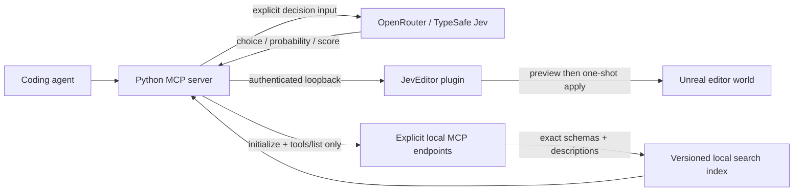

# Architecture

Jev_Unreal is two components: a Python stdio MCP server and an Unreal editor-only C++ plugin. The editor tools work without a model key. The optional Jev client uses hosted typed decisions through OpenRouter or TypeSafe.

There is no Jev-to-execution edge. A decision returns a candidate ID. The caller supplies operation arguments, reviews a preview, and chooses whether to execute within the user's authorization. The editor validates operations independently.

## Wire boundaries

MCP uses the official Python SDK over stdio. Standard output carries only the protocol. Decision requests use fixed HTTPS provider endpoints with environment proxy inheritance and redirects disabled. Bridge requests use a literal loopback origin. API keys are never sent to Unreal; bridge tokens are never sent to Jev.

The local bridge protocol is versioned by path: `POST /jev/v1/call`, body `{action,params}`, envelope `{ok:true,result}` or `{ok:false,error:{code,message}}`. Unreal owns scene validation, plan lifetime and transactions. Python repeats project identity validation before every call, and requires `JEV_EXPECTED_PROJECT` for preview/apply.

The plugin has no runtime game module. Shipping games do not need Python, Jev credentials or this HTTP listener. Runtime NPC decisions require a separate server-authoritative design and are outside version 0.2.

## Reliability and privacy

- Decisions: 32 questions per call; 64 KiB request; 256 KiB response; 15-second network timeout; one in-flight provider call; 100 requests per process by default; no implicit retries. The request cap counts attempts, including failures. It is not a dollar budget.
- Cache: up to 128 exact request hashes, 60-second TTL, in-memory only. Identical concurrent requests reuse the first validated result. Cached results retain original provider usage; `cached:true` means this call incurred no new provider request.
- Circuit breaker: three consecutive provider failures pause further calls for 30 seconds. There is no provider fallback that silently changes the model.
- Routing: requires supplied probability distribution and confidence. Initial gates are confidence >=0.65, winning probability >=0.70 and margin >=0.20; missing evidence or `__defer__` returns deferral. These are conservative defaults, not measured error guarantees.
- Only explicit decision arguments leave the machine. Actor snapshots, assets and preview plans are not automatically uploaded. Callers should minimize and sanitize excerpts before choosing a cloud tool.
- The local token protects against accidental or unauthorized network clients, not malicious software running as the same Windows user. Treat the entire editor process as trusted.
- Plans have a 120-second lifetime and are consumed once. They bind to the actual editor world and actor instances, plus a fingerprint of actor paths, labels, transforms, attachment/root identity, visibility, locking and current level. This is not a hash of every component, material or asset property. Transforms are limited to exact native, unattached StaticMeshActors; Blueprint construction scripts are outside the transaction guarantee. Apply uses native Undo and does not save packages. After a timeout, inspect the scene before deciding what to do next.
- The HTTPServer engine module reads bodies before plugin validation. The operation payload cap is not a defense against malicious software on the same workstation. This bridge is not designed for internet or multiuser hosting.

## Extension points

The `DecisionClient`, tool catalog, asset selector and diagnostic grouper do not depend on Unreal. `ToolCatalog` discovers explicit loopback Streamable HTTP endpoints using initialization and `tools/list`; transport policy rejects external `tools/call`. It preserves schemas, derives bounded action presets, atomically caches a complete snapshot and searches locally. It never launches servers or automatically uploads catalogs. [Discovery contracts](TOOL_DISCOVERY.md).

Asset filtering and log grouping default to local processing. Their explicit `use_jev` option sends only supplied bounded data; local results survive provider failures with distinct requested/attempted/used flags. Returned metadata is not automatically verified against Unreal, and logs are not automatically read. [Semantic helper contracts](SEMANTIC_TOOLS.md).

Layout compilation is deterministic math, producing existing preview operations. `PreviewTracker` keeps at most 64 short-lived normalized expectations in memory and verifies identity/transform readbacks after native application. It checks quaternion orientation equivalence, not just Euler spelling. Verification failure preserves the applied result; it never silently retries or rolls back an already-applied operation. A process restart loses its verification records, which is reported explicitly.

Native inspection reports independent truncation flags and exact object paths. Framing validates the requested actors and rejects piloted/locked viewports before moving the editor camera. Capture reads only that editor viewport and returns a bounded PNG directly as MCP image content, with no arbitrary file access. Capture structure/CRCs are validated before delivery. Rendering evidence, deterministic warning checks and gameplay acceptance remain separate. [Native contracts](NATIVE_TOOLS.md).

Useful next work: representative held-out task evaluation, more measured operations, configurable per-project bridge ports, wider platform validation and a Blender adapter. Improvements in total task time/cost must be measured against direct tool use and deterministic retrieval before they are claimed.
