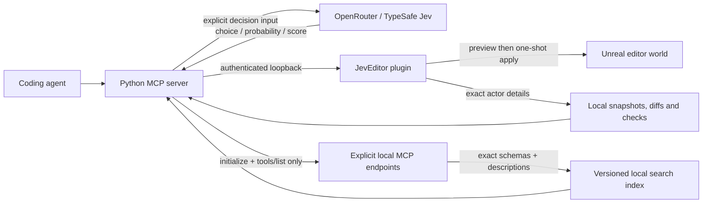

# Architecture

Jev_Unreal has two components: a Python stdio MCP server and an Unreal editor-only C++ plugin. The 0.3 alpha exposes 27 MCP tools. Editor inspection, measured editing and verification work without a model key. The optional Jev client uses hosted typed decisions through OpenRouter or TypeSafe.

There is no Jev-to-execution edge. A decision returns a candidate ID. The caller supplies operation arguments, reviews a preview, and chooses whether to execute within the user's authorization. The editor validates operations independently.

## Wire boundaries

MCP uses the official Python SDK over stdio. Standard output carries only the protocol. Decision requests use fixed HTTPS provider endpoints with environment proxy inheritance and redirects disabled. Bridge requests use a literal loopback origin. API keys are never sent to Unreal; bridge tokens are never sent to Jev.

The local bridge protocol is versioned by path: `POST /jev/v1/call`, body `{action,params}`, envelope `{ok:true,result}` or `{ok:false,error:{code,message}}`. Unreal owns scene validation, plan lifetime and transactions. Python repeats project identity validation before every call, and requires `JEV_EXPECTED_PROJECT` for preview, apply and camera framing.

Status advertises native capabilities. The bridge requires the relevant capability before dispatching exact actor inspection, state-bound previews, material edits, metadata edits and camera presets. An older plugin produces `capability_unavailable` rather than silently skipping a requested safeguard. Default current-view framing keeps the legacy request shape; explicit presets require `frame_views`. Capabilities are refreshed with each status read; they indicate support, not authorization. CLI `doctor` reports whether the inspect/edit/verify workflow's required capabilities are present.

The plugin has no runtime game module. Shipping games do not need Python, Jev credentials or this HTTP listener. Runtime NPC decisions require a separate server-authoritative design and remain outside this editor integration.

## Inspect, edit and verify

`actor_details` reads 1–20 exact loaded actor paths in requested order. Its state
includes project, session, world, current level and revision. Actor records include
an opaque live `instance_id`, transforms, world AABBs, material assignments and
explicit native edit blockers. Missing bounds and truncated material lists remain
explicit; AABBs are not collision geometry.

`SceneSnapshots` retains a selected-actor baseline. A later diff obtains fresh
details, requires matching project/session/world and live actor instances, and
reports changes only within the selected records. A missing actor is unverifiable,
not proof of deletion. Reusing a path for a replacement actor is also unverifiable.
An unchanged diff does not establish that unreported state or the rest of the
world is unchanged.

Layout recipes calculate new blockout transforms locally. Spatial recipes use
native measurements to align, distribute, snap pivots or ground existing actors
on an explicit plane. They generate existing `set_transform` operations while
preserving rotation and scale. Spatial previews supply the measured
`expected_state: {session_id, world_path, revision}` to native preview; explicit
material and metadata previews can use the same precondition. This closes the
gap between measuring and creating a plan. Applying the plan performs its own
stale-state checks afterward.

Supported existing-actor mutations are transforms, assigning an existing material
to an existing slot, and changing actor labels/folders. They require exact native
StaticMeshActors without parent, child or child-actor attachments and without
native edit blockers. A batch contains at most 20 operations and at most one
operation per existing actor. No generic property writer, script executor or
Blueprint graph editor is exposed.

`PreviewTracker` retains normalized expectations and compares the native apply
readback against requested transforms, identities and relevant metadata/material
fields. Rotation comparison accepts equivalent quaternion orientations. An
expired or absent expectation cannot claim verification. Readback mismatches and
receipt failures preserve a confirmed native apply result; Python never retries
or silently reverses an applied edit.

`unreal_verify` independently reads the actors again and evaluates up to 64 typed
checks over at most 20 actors. Results are passed, failed or unverifiable. Generated
spatial checks carry the inspected live instance IDs and measured target values;
callers should also bind post-edit verification to the original project/session/
world. Do not require the pre-edit revision after an intended edit. Numeric and
material checks are distinct from rendered review, collision behavior and gameplay
acceptance. [Spatial contracts](SPATIAL_WORKFLOWS.md) and
[verification contracts](VERIFICATION.md) document exact predicates and tolerances.

## Process-local state

| Store | Limits | Meaning |
| --- | --- | --- |
| Preview expectations | 64 plans; at most the native 120-second lifetime | Compare a known preview with the immediate native apply readback |
| Plan records | 64 records; 2 MiB serialized total; 64 KiB per record; 15 minutes from first record | Review the last outcome observed by this MCP process; details can be omitted |
| Attempt guard | 64 IDs; 15 minutes from the attempt | Suppress local repeated apply calls even when recording fails |
| Actor snapshots | 32 snapshots; 2 MiB serialized total; 15 minutes | Selected-actor baselines for later fresh diffs |

Python object overhead is additional to serialized byte limits. Capacity pressure
evicts records, expiration removes them, and a process restart clears every store.
Updating a plan record does not extend its original retention indefinitely.
Plan states distinguish previewed, applying, applied, rejected and unknown;
transport loss, cancellation or uncertain rollback stays unknown. `unreal_plan`
returns a best-effort client observation and performs no fresh editor read.
These stores are not durable receipts, backups, a retry queue or crash recovery.
Native one-shot plans and editor transactions remain authoritative.

## Reliability and privacy

- Decisions: 32 questions per call; 64 KiB request; 256 KiB response; 15-second network timeout; one in-flight provider call; 100 requests per process by default; no implicit retries. The request cap counts attempts, including failures. It is not a dollar budget.
- Cache: up to 128 exact request hashes, 60-second TTL, in-memory only. Identical concurrent requests reuse the first validated result. Cached results retain original provider usage; `cached:true` means this call incurred no new provider request.
- Circuit breaker: three consecutive provider failures pause further calls for 30 seconds. There is no provider fallback that silently changes the model.
- Routing: requires supplied probability distribution and confidence. Initial gates are confidence >=0.65, winning probability >=0.70 and margin >=0.20; missing evidence or `__defer__` returns deferral. These are conservative defaults, not measured error guarantees.
- Only explicit decision arguments leave the machine. Actor snapshots, assets and preview plans are not automatically uploaded. Callers should minimize and sanitize excerpts before choosing a cloud tool.
- The local token protects against accidental or unauthorized network clients, not malicious software running as the same Windows user. Treat the entire editor process as trusted.
- Plans have a 120-second lifetime and are consumed once. They bind to the actual editor world and actor instances, plus tracked actor paths, labels/folders, transforms, attachment/root identity, visibility, locking/editability and current level. Static-mesh state additionally includes live mesh identity, world bounds, material/override counts and bounded assignment identities. This is not a hash of every component, material parameter or asset byte. Apply uses native Undo and does not save packages. After a timeout, inspect the plan record and fresh actors before making another plan.
- The HTTPServer engine module reads bodies before plugin validation. The operation payload cap is not a defense against malicious software on the same workstation. This bridge is not designed for internet or multiuser hosting.

## Extension points

The `DecisionClient`, tool catalog, asset selector and diagnostic grouper do not depend on Unreal. `ToolCatalog` discovers explicit loopback Streamable HTTP endpoints using initialization and `tools/list`; transport policy rejects external `tools/call`. It preserves schemas, derives bounded action presets, atomically caches a complete snapshot and searches locally. It never launches servers or automatically uploads catalogs. [Discovery contracts](TOOL_DISCOVERY.md).

Asset filtering and log grouping default to local processing. Their explicit `use_jev` option sends only supplied bounded data; local results survive provider failures with distinct requested/attempted/used flags. Returned metadata is not automatically verified against Unreal, and logs are not automatically read. [Semantic helper contracts](SEMANTIC_TOOLS.md).

Native inspection reports independent truncation flags and exact object paths. Framing validates every requested actor and rejects piloted/locked viewports before moving the editor camera. `view` accepts `current` (default), `isometric`, `top`, `front` or `right`; directional presets require a perspective viewport and do not change projection. Actor selection is preserved. Capture reads only that editor viewport and returns a bounded PNG directly as MCP image content, with no arbitrary file access. Capture structure/CRCs are validated before delivery. Rendering evidence, deterministic warning checks and gameplay acceptance remain separate. [Native contracts](NATIVE_TOOLS.md).

CLI `inspect` reads explicit paths; CLI `verify` reads a caller-selected JSON file
of at most 64 KiB and runs fresh checks. Neither invokes a provider. The MCP
`verified_edit_workflow` prompt and `jev://checks` examples connect these pieces
without inventing goals or permissions.

The [roadmap](ROADMAP.md) prioritizes review UI, installation/repair, project-owned
validation and tests, workflow evaluation and later Blender handoff. These remain
separate engineering work. Improvements in total task time/cost must be measured
against direct tool use and deterministic retrieval before they are claimed.
