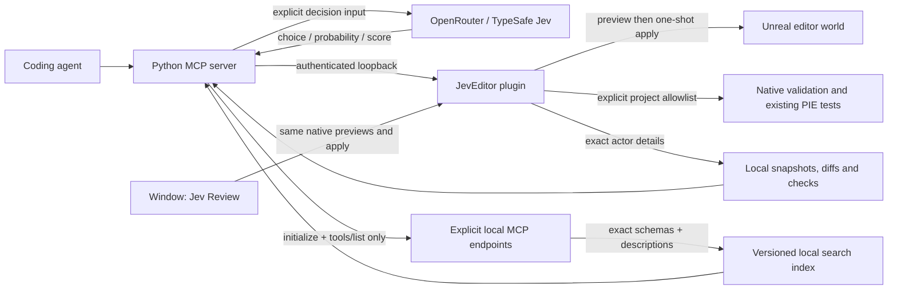

# Architecture

Jev_Unreal has two components: a Python stdio MCP server and an Unreal editor-only C++ plugin. The 0.6 alpha exposes 40 MCP tools. Local inspection, measured editing, review and project-owned checks work without a model key. The optional Jev client uses hosted typed decisions through OpenRouter or TypeSafe.

There is no Jev-to-execution edge. A decision returns a candidate ID. The caller supplies operation arguments, reviews a preview, and chooses whether to execute within the user's authorization. The editor validates operations independently.

## Wire boundaries

MCP uses the official Python SDK over stdio. Standard output carries only the protocol. Decision requests use fixed HTTPS provider endpoints with environment proxy inheritance and redirects disabled. Bridge requests use a literal loopback origin. API keys are never sent to Unreal; bridge tokens are never sent to Jev.

The local bridge protocol is versioned by path: `POST /jev/v1/call`, body `{action,params}`, envelope `{ok:true,result}` or `{ok:false,error:{code,message}}`. Unreal owns scene validation, plan lifetime and transactions. The listener binds only `127.0.0.1` at `JEV_BRIDGE_PORT` (1024–65535; default 9845). Invalid configuration or a port conflict disables it. The matching Host header and bearer token are required; browser Origin headers are rejected.

Python reads authenticated status before every operation and compares its project with the configured binding. Preview, apply, camera framing and project-job start/cancel require an explicit project. That binding comes from `JEV_EXPECTED_PROJECT` or a selected [connection profile](CONNECTION_PROFILES.md). A profile selects the project, endpoint and token file together at MCP startup; it does not inherit a legacy token or retarget a running process. Each selected editor uses its own MCP process.

Status advertises bridge version `0.6.0` and native capabilities. Python requires the relevant capability before dispatching exact actor inspection, state-bound previews, material/metadata edits, mesh replacement/copying, camera presets, native history or project tools. An older plugin produces `capability_unavailable` rather than silently skipping a requested safeguard. Default current-view framing keeps the legacy request shape; explicit presets require `frame_views`. Capabilities are refreshed with each status read; they indicate support, not project permission. CLI `doctor` reports whether the inspect/edit/verify workflow's required capabilities are present.

For `validation_start`, Python also puts the authenticated status's exact project,
session, world and revision into the native request. Native code checks these before
queueing any callback, so an endpoint reused by a restarted editor cannot satisfy
the earlier preflight. Functional starts require the caller's inspected
`expected_state`; native code checks it before queueing and again before execution.

The plugin has no runtime game module. Shipping games do not need Python, Jev credentials or this HTTP listener. Runtime NPC decisions require a separate server-authoritative design and remain outside this editor integration.

## Inspect, edit and verify

`actor_details` reads 1–20 exact loaded actor paths in requested order. Its state
includes project, session, world, current level and revision. Actor records include
an opaque live `instance_id`, transforms, world AABBs, material assignments and
explicit native edit blockers. Missing bounds and truncated material lists remain
explicit; AABBs are not collision geometry.

Mesh recipes use the same exact actor selection to replace a mesh or create a
controlled native copy. Their normalized preview retains effective/override
materials, bounded component settings, local mesh bounds and collision metadata.
Weak identities, selected metadata fingerprints and a conservative editor asset
property-change counter invalidate reviewed plans when those observations change.
These guards do not hash all mesh geometry or sandbox third-party callbacks.
Fresh checks verify the declared mesh state after application; rendered and
gameplay/collision acceptance remain separate.

`SceneSnapshots` retains a selected-actor baseline. A later diff obtains fresh
details, requires matching project/session/world and live actor instances, and
reports changes only within the selected records. A missing actor is unverifiable,
not proof of deletion. Reusing a path for a replacement actor is also unverifiable.
An unchanged diff does not establish that unreported state or the rest of the
world is unchanged.

Layout recipes calculate new blockout transforms locally. Spatial recipes use
native measurements to align, distribute, snap pivots or ground existing actors
on an explicit plane. They generate existing `set_transform` operations while
preserving rotation and scale. Spatial previews supply the measured
`expected_state: {session_id, world_path, revision}` to native preview; explicit
material and metadata previews can use the same precondition. This closes the
gap between measuring and creating a plan. Applying the plan performs its own
stale-state checks afterward.

Supported existing-actor mutations are transforms, assigning an existing material
to an existing slot, changing actor labels/folders, and replacing a mesh under an
explicit material policy. Controlled mesh copies create new actors from bounded
source state. These operations require exact native StaticMeshActors without
parent, child or child-actor attachments and without native edit blockers; copying
has additional component/property and current-level restrictions documented in
[mesh workflows](MESH_WORKFLOWS.md). A batch contains at most 20 operations and at
most one operation per existing actor. No generic property writer, script executor
or Blueprint graph editor is exposed.

`PreviewTracker` retains normalized expectations and compares the native apply
readback against requested transforms, identities and relevant metadata/material
fields. Rotation comparison accepts equivalent quaternion orientations. An
expired or absent expectation cannot claim verification. Readback mismatches and
receipt failures preserve a confirmed native apply result; Python never retries
or silently reverses an applied edit.

`unreal_verify` independently reads the actors again and evaluates up to 64 typed
checks over at most 20 actors. Results are passed, failed or unverifiable. Generated
spatial checks carry the inspected live instance IDs and measured target values;
callers should also bind post-edit verification to the original project/session/
world. Do not require the pre-edit revision after an intended edit. Numeric and
material checks are distinct from rendered review, collision behavior and gameplay
acceptance. [Spatial contracts](SPATIAL_WORKFLOWS.md) and
[verification contracts](VERIFICATION.md) document exact predicates and tolerances.

## Review and process-local state

**Window → Jev Review** uses the same native inspection, previews and apply path
as MCP. A human can inspect selected actors, review a translation or label/folder
change, and apply the reviewed one-shot plan. MCP-created pending plans are also
visible. The 0.6 presentation changes neither the authenticated bridge contract
nor the 40-tool MCP catalog. It adds no execution path or permissions.

A deterministic presentation layer formats the native record into operation-order
**Field / Before / After** content. It does not resolve editor objects, invoke a
provider, authorize a plan or execute an edit. All supported operations have
readable summaries; complete bounded mesh detail remains in a collapsed technical
section. This display is limited to reported native state, not a complete asset or
component serialization.

The reviewed plan body is separate from mutable status and expiry text. Read-only
inspection, review, technical and result widgets support text selection and
keyboard focus. An explicit successful preview/review focuses its content; an
explicit action error focuses recovery guidance with the native code. The two-second refresh only
reads and preserves focus and text selection when only status/countdown changes.
It never approves, applies, retries or saves automatically. Tab/Shift+Tab use Slate
navigation; Apply requires deliberate button activation and has no global shortcut.
Error guidance does not infer an unchanged scene from a failed or uncertain call.

Fixed labels use localization-ready Unreal text, without claiming translations
or screen-reader, accessibility or representative-user acceptance. Rendered and
automation evidence is recorded separately in [validation](VALIDATION.md).
[Panel behavior](REVIEW_PANEL.md) describes the human workflow and recovery steps.

The Python process retains these bounded stores:

| Store | Limits | Meaning |
| --- | --- | --- |
| Preview expectations | 64 plans; at most the native 120-second lifetime | Compare a known preview with the immediate native apply readback |
| Client plan records | 64 records; 2 MiB serialized total; 64 KiB per record; 15 minutes from first record | Review the last outcome observed by this MCP process; details can be omitted |
| Attempt guard | 64 IDs; 15 minutes from the attempt | Suppress local repeated apply calls even when recording fails |
| Actor snapshots | 32 snapshots; 2 MiB serialized total; 15 minutes | Selected-actor baselines for later fresh diffs |

Python object overhead is additional to serialized byte limits. Capacity pressure
evicts records, expiration removes them, and a process restart clears every store.
Updating a plan record does not extend its original retention indefinitely.
Client states distinguish previewed, applying, applied, rejected and unknown;
transport loss, cancellation or uncertain rollback stays unknown.

Native plan history separately retains up to 64 records for 15 minutes from
creation in the editor process. Pending plans remain executable for 120 seconds.
Completed records are evicted before pending records; in-flight records are
protected from pruning and nested mutations. Native statuses distinguish pending,
applying, applied, rejected, expired, rolled_back and unknown. `unreal_pending_plans`
lists current previews. `unreal_plan` first reads the native receipt; if that fails,
it can return the current MCP process's observation with `native_lookup_error`.
A fallback is not confirmation that the editor received or completed an operation.

Native receipts survive an MCP reconnect while the editor stays open, and remain
historical after Undo or later edits. Editor restart/crash loses them. Neither
native nor client records are durable receipts, backups, a retry queue or crash
recovery; use fresh inspection and verification before deciding the next edit.

## Project inspection and approved jobs

[Blueprint inspection](PROJECT_INSPECTION.md) reads an exact already-loaded native
Blueprint's stored variables, graph/node/pin identities and diagnostics. It does
not load or compile the asset, edit graphs or invoke extension graph callbacks.
Bounds, visited graph identities and explicit truncation flags constrain the read.
Asset Registry dependency queries return direct edges with pagination; import
provenance returns recorded source basenames/timestamps/hashes without opening
the source files. These are partial inspection evidence, not new compilation,
runtime dependency validation or DCC round-trip acceptance.

Data Validation and [functional test jobs](FUNCTIONAL_TESTS.md) are disabled by
default. The maintainer configures separate allowlists in `DefaultGame.ini` for
loaded native validator classes and exact placed functional tests. A validation
job selects 1–8 rules and 1–20 exact assets, processes one pair per editor tick,
and distinguishes valid, invalid and not-validated results. Functional execution
runs one approved test in an already-running single standalone PIE session;
the adapter never starts/stops PIE or supports Simulate/multiplayer sessions.
Only one project job can run across the two adapters at a time.

The module dispatches project tools separately from scene edits. Status, context,
history, project inspection, rule/test listing and retained job reads remain
available during Play/Simulate. Scene edits and most scene inspection/capture
actions still refuse it. Validation starts refuse Play/Simulate and pending work
cancels if play begins. Functional start requires its supported PIE state.

Callbacks are trusted project code, with possible loading, mutation, saving and
external effects. The adapter requests no save and cannot sandbox them: job
receipts use `save_requested=false`, `saved=null` and
`callback_side_effects_tracked=false`. Cancellation and 1–120-second configured
deadlines are cooperative between callbacks. Identity/configuration checks and
reentry guards protect job ownership. A functional receipt binds exact editor/PIE
actor and world identities plus the native run, so cancelling an old job cannot
stop a later run on the same actor. Cleanup returning is not proof of complete
restoration. Observed functional-test assertion errors cannot be overridden by an
explicit success result.

Validation retains up to eight job records, and functional testing up to 64,
for 15 minutes after completion in editor memory. Restarts discard them.

## Reliability and privacy

- Decisions: 32 questions per call; 64 KiB request; 256 KiB response; 15-second network timeout; one in-flight provider call; 100 requests per process by default; no implicit retries. The request cap counts attempts, including failures. It is not a dollar budget.
- Cache: up to 128 exact request hashes, 60-second TTL, in-memory only. Identical concurrent requests reuse the first validated result. Cached results retain original provider usage; `cached:true` means this call incurred no new provider request.
- Circuit breaker: three consecutive provider failures pause further calls for 30 seconds. There is no provider fallback that silently changes the model.
- Routing: requires supplied probability distribution and confidence. Initial gates are confidence >=0.65, winning probability >=0.70 and margin >=0.20; missing evidence or `__defer__` returns deferral. These are conservative defaults, not measured error guarantees.
- Only explicit decision arguments leave the machine. Actor snapshots, assets and preview plans are not automatically uploaded. Callers should minimize and sanitize excerpts before choosing a cloud tool.
- The local token protects against accidental or unauthorized network clients, not malicious software running as the same Windows user. Treat the entire editor process as trusted.
- Plans have a 120-second lifetime and are consumed once. They bind to the actual editor world and actor instances, plus tracked actor paths, labels/folders, transforms, attachment/root identity, visibility, locking/editability and current level. Static-mesh state additionally includes live mesh identity, world bounds, material/override counts and bounded assignment identities. This is not a hash of every component, material parameter or asset byte. Apply uses native Undo and does not save packages. After a timeout, inspect the plan record and fresh actors before making another plan.
- The HTTPServer engine module reads bodies before plugin validation. The operation payload cap is not a defense against malicious software on the same workstation. This bridge is not designed for internet or multiuser hosting.

## Extension points

The `DecisionClient`, tool catalog, asset selector and diagnostic grouper do not depend on Unreal. `ToolCatalog` discovers explicit loopback Streamable HTTP endpoints using initialization and `tools/list`; transport policy rejects external `tools/call`. It preserves schemas, derives bounded action presets, atomically caches a complete snapshot and searches locally. It never launches servers or automatically uploads catalogs. [Discovery contracts](TOOL_DISCOVERY.md).

Asset filtering and log grouping default to local processing. Their explicit `use_jev` option sends only supplied bounded data; local results survive provider failures with distinct requested/attempted/used flags. Returned metadata is not automatically verified against Unreal, and logs are not automatically read. [Semantic helper contracts](SEMANTIC_TOOLS.md).

Native inspection reports independent truncation flags and exact object paths. Framing validates every requested actor and rejects piloted/locked viewports before moving the editor camera. `view` accepts `current` (default), `isometric`, `top`, `front` or `right`; directional presets require a perspective viewport and do not change projection. Actor selection is preserved. Capture reads only that editor viewport and returns a bounded PNG directly as MCP image content, with no arbitrary file access. Capture structure/CRCs are validated before delivery. Rendering evidence, deterministic warning checks and gameplay acceptance remain separate. [Native contracts](NATIVE_TOOLS.md).

CLI `inspect` reads explicit paths; CLI `verify` reads a caller-selected JSON file
of at most 64 KiB and runs fresh checks. Neither invokes a provider. The MCP
`verified_edit_workflow` prompt and `jev://checks` examples connect these pieces
without inventing goals or permissions.

The [reviewed installer](SETUP.md) is a local CLI path, separate from the bridge.
It plans source-file changes and the project's JevEditor enablement, validates
hashes before apply, retains owned backups and preserves modified/untracked files.
It neither builds Unreal nor loads credentials or controls editor processes.

The [benchmark harness](BENCHMARKS.md) separates routing decisions from manually
supplied workflow outcomes; its public synthetic sample does not measure total
task efficiency. The [roadmap](ROADMAP.md) keeps representative usability and
fresh-machine studies, crash-durable recovery, wider gameplay validation, real
workflow comparisons and later Blender handoff open. Improvements in total task
time/cost must be measured against direct tool use and deterministic retrieval.
