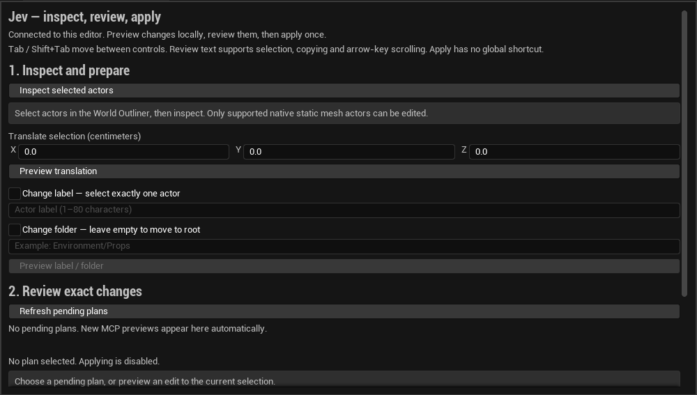

# Review changes inside Unreal

Open **Window → Jev Review** in a rendered Unreal editor with JevEditor enabled.
The panel uses the same native preview, plan receipt and apply implementation as
MCP. It works without a Jev/OpenRouter key. A configured bridge token is required
to enable controls; a disabled panel explains the startup problem.

The panel separates readable changes, technical detail and the latest outcome.
The images below document the 0.6 baseline; newer accessibility checks are listed
in [validation evidence](VALIDATION.md).

Version 0.7 also has a [320-pixel expanded-label capture](images/review-panel-v0.7-narrow-pseudo.png)
and [scrolled error/result view](images/review-panel-v0.7-narrow-result.png).
These use deliberately expanded English strings, not an actual translation.
Labels wrap inside the narrow panel and the error remains reachable after native
keyboard activation. Actual screen-reader delivery and representative users are
covered by the separate [community acceptance protocol](COMMUNITY_ACCEPTANCE.md).

The panel scrolls when its content exceeds the available editor-tab height.
The [action-area capture](images/review-panel-v0.6-actions.png) shows the disabled
Apply control after scrolling. [Selected transform review](images/review-panel-v0.6-transform.png),
[mesh review](images/review-panel-v0.6-mesh.png) and
[selection-error guidance](images/review-panel-v0.6-error.png) were captured directly
from the native text widgets. See [validation evidence](VALIDATION.md) for the
separate rendered keyboard tests and acceptance limits.

1. Select native static mesh actors in the World Outliner and choose **Inspect
   selected actors**. Read their measured bounds, transforms and edit blockers.
2. Enter a translation in centimeters, or enable label/folder changes. Preview
   creates a plan without changing the scene. Blueprint actors and attachments
   remain outside the supported editing scope.
3. Read the **Field / Before / After** changes. An MCP-created pending plan also
   appears in the panel; select its review button to read the same native plan,
   project and world. Expand technical detail when reviewing material overrides,
   collision settings or mesh metadata.
4. Choose **Apply reviewed plan once** deliberately. Changes use an Unreal Undo
   transaction; the bridge requests no save. Changed scenes, expired plans and
   replaced targets are rejected.
5. Inspect the applied actors again. For explicit pass/fail evidence, run MCP
   `unreal_verify` with requirements derived from the task and capture the result.

## Reading and keyboard navigation

Inspection, plan review, technical detail and result text are read-only,
selectable and keyboard-focusable. Use Tab and Shift+Tab to move between enabled
controls, and select/copy text without changing the plan. A successful explicit
preview or pending-plan review focuses the review content. An explicit action error focuses the
result so its native error code and suggested next step are available together.

The panel refreshes pending plans every two seconds while open. Status and expiry
countdown update separately from the reviewed plan body. A refresh that only
updates status/countdown preserves review text selection and keyboard focus; it
does not bring the review into focus again. Plan changes, expiry or unavailable
receipts can disable Apply. Native checks still decide whether an attempted apply
is valid, regardless of the displayed countdown.

A failed passive lookup appears in the separate plan-status area and disables
Apply. It preserves the last explicit action result and any selection in that
text, including when a receipt ages out of editor memory. An explicit failed
action or refresh can replace the result with its own recovery guidance.

There is no global Apply shortcut. Reading the review, pressing Enter in an edit
field, or refreshing the list does not apply a plan. Activate the focused **Apply
reviewed plan once** button when ready. The panel never approves automatically,
retries an interrupted apply, saves a map, or sends scene information to a model.

Fixed interface labels use Unreal localization-ready text. Action, checkbox and
section labels wrap in narrow panels. Numeric fields and selectable text name
the actual focusable descendants, including their axis and units, as well as the
outer field. Explicit result changes request an accessible announcement capped at
512 characters when engine accessibility is active. Passive polling does not
announce countdowns or repeat the last result. The full result remains readable
and copyable in its text field.

`Jev.Editor.ReviewAccessibleNames` checks semantic names on focusable descendants.
`Jev.Rendered.ReviewNarrowAccessibility` exercises a 320-pixel panel, synthetically
expanded English labels, explicit error focus and announcement requests across a
passive refresh. Its native captures are `ReviewPanelNarrowPseudo.png` and
`ReviewPanelNarrowResult.png` under the sandbox Saved/Automation/Jev directory.
The expansion is a layout stress fixture, not a translation. The observer checks
announcement requests, not OS or screen-reader delivery. Translations and
localized-layout acceptance are not supplied. Keyboard-focused automation and
rendered captures, where recorded in [validation](VALIDATION.md), do not establish
screen-reader support, broad accessibility or representative artist usability;
those acceptance studies remain open.

Epic's [screen-reader guidance](https://dev.epicgames.com/documentation/unreal-engine/supporting-screen-readers-in-unreal-engine)
describes engine accessibility configuration. Named Slate controls alone do not
prove that a particular screen reader works with this panel.

## What the review contains

Operations retain their original order. Each operation names its target and
shows relevant **Field / Before / After** values, including units for transforms,
the root folder when a folder is empty, and explicit absence for a newly created
actor. The review supports primitive and mesh spawning, transforms, material
assignment, labels/folders, mesh replacement and controlled mesh copies.

Replacement review names the old/new mesh and material policy; copy review names
its source, new label and transform. The collapsed technical-detail section
retains the complete bounded native mesh review, including material slots,
overrides, collision responses and mesh settings. Expanding it changes only the
display. This is the state reported by the bridge, not every Unreal property or
a hash of every asset byte. [Mesh workflow limits](MESH_WORKFLOWS.md) still apply.
Mesh recipes are created through MCP; the panel's own creation controls remain
translation and metadata.

Review formatting is local and deterministic. It does not ask a model to rewrite
the plan or decide whether it is safe. Readable descriptions do not grant
permissions, add editable properties, or bypass stale-plan and one-shot checks.

## Errors and uncertain outcomes

The result retains the native error code and provides recovery guidance. Resolve
selection or edit blockers before making another preview. If a plan is stale or
expired, inspect the actors again and create a fresh plan. If application or
receipt lookup has an uncertain outcome, inspect the native receipt and current
actors before deciding what to do next. An error message alone does not prove
that no scene change occurred. The panel never retries an apply for you.

## Outcomes after reconnecting MCP

`unreal_pending_plans` lists current native previews. `unreal_plan(plan_id)` first
reads the native receipt and falls back to the current MCP process's historical
observation if that read fails. The fallback carries `native_lookup_error`; it is
not confirmation that the editor received or completed the operation.

Native receipts keep up to 64 records for 15 minutes. A pending preview can be
applied for 120 seconds. Completed records are evicted before pending records.
Receipts report project/world/session, before values, normalized operations,
outcome and affected paths. Their statuses distinguish pending, applying, applied,
rejected, expired, rolled_back and unknown. They are stored only in editor memory:
MCP reconnection preserves them, but closing/crashing Unreal loses them.

A receipt is historical. Later edits or Undo can change the scene while its
status remains `applied`. Always take fresh measurements. A receipt does not save
the project or establish gameplay, visual quality or crash recovery.
