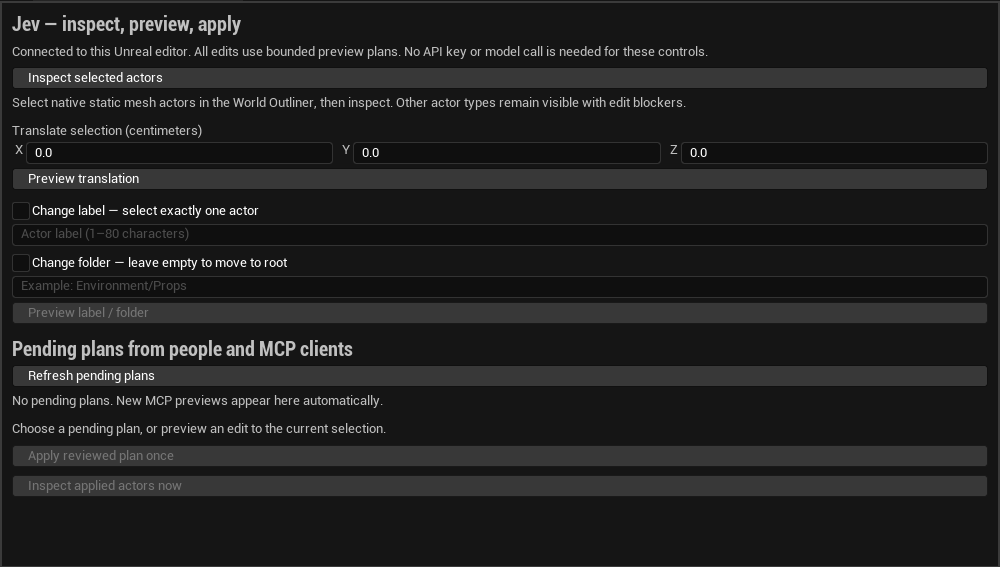

# Review changes inside Unreal

Open **Window → Jev Review** in a rendered Unreal editor with JevEditor enabled.
The panel uses the same native preview, plan receipt and apply implementation as
MCP. It works without a Jev/OpenRouter key. A configured bridge token is required
to enable controls; a disabled panel explains the startup problem.

1. Select native static mesh actors in the World Outliner and choose **Inspect
   selection**. Read their measured bounds, transforms and edit blockers.
2. Enter a translation in centimeters, or enable label/folder changes. Preview
   creates a plan without changing the scene. Blueprint actors and attachments
   remain outside the supported editing scope.
3. Review the before/after values. An MCP-created pending plan also appears in the
   panel; select its review button to see the same native operations and identity.
4. Choose **Apply reviewed plan** once. Changes use an Unreal Undo transaction and
   remain unsaved. Changed scenes, expired plans and replaced targets are rejected.
5. Inspect the applied actors again. For explicit pass/fail evidence, run MCP
   `unreal_verify` with requirements derived from the task and capture the result.

The panel refreshes pending plans every two seconds while open. It never approves
or applies automatically, retries an interrupted apply, saves a map, or sends
scene information to a model. Controls use standard Slate buttons, text fields
and numeric entries; broad keyboard/accessibility and artist usability acceptance
still require representative user testing.

## Outcomes after reconnecting MCP

`unreal_pending_plans` lists current native previews. `unreal_plan(plan_id)` first
reads the native receipt and falls back to the current MCP process's historical
observation if that read fails. The fallback carries `native_lookup_error`; it is
not confirmation that the editor received or completed the operation.

Native receipts keep up to 64 records for 15 minutes. A pending preview can be
applied for 120 seconds. Completed records are evicted before pending records.
Receipts report project/world/session, before values, normalized operations,
outcome and affected paths. Their statuses distinguish pending, applying, applied,
rejected, expired, rolled_back and unknown. They are stored only in editor memory:
MCP reconnection preserves them, but closing/crashing Unreal loses them.

A receipt is historical. Later edits or Undo can change the scene while its
status remains `applied`. Always take fresh measurements. A receipt does not save
the project or establish gameplay, visual quality or crash recovery.
